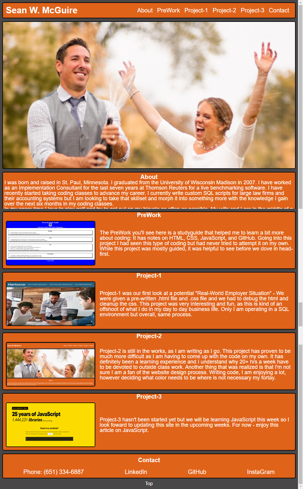

# Challenge-2

## Description

The goal of this challenge is to create a portfolio site that highlights the work that I have done in class, so that, when the class is complete I will have a legup on other competition.  Since most employers will need a "book of work" this will act as my online repository for class projects.  

This project is just a start as we only have two projects completed.  However, as the course goes on, the portfolio site will be updated with new skillsets that I have acquired.

I look forward to updating my portfolio on an ongoing basis to keep my projects up-to-date as well as make modifications to the overall site design, CSS and JavaScript.

## Installation

No installation needed - can launch the site by visiting:  https://swmcguire.github.io/Challenge-2/.

Once there please take a look at my book of work and see what you think.

## Usage

The usage of the website is to display my current work and ongoing work.  This will eventually grow into a more robust website showcasing all my work and morph into a cleaner more functional site highlighting all of my newfound skills.

## Credits

https://www.w3schools.com/csSref/sel_hover.php
https://developer.mozilla.org/en-US/docs/Web/CSS/:hover
https://www.w3schools.com/css/css_selectors.asp
https://www.w3schools.com/css/css_combinators.asp
https://www.w3schools.com/css/css_pseudo_classes.asp
https://flexboxfroggy.com/

## License

Copyright 2022

Permission is hereby granted, free of charge, to any person obtaining a copy of this software and associated documentation files (the "Software"), to deal in the Software without restriction, including without limitation the rights to use, copy, modify, merge, publish, distribute, sublicense, and/or sell copies of the Software, and to permit persons to whom the Software is furnished to do so, subject to the following conditions:

The above copyright notice and this permission notice shall be included in all copies or substantial portions of the Software.

THE SOFTWARE IS PROVIDED "AS IS", WITHOUT WARRANTY OF ANY KIND, EXPRESS OR IMPLIED, INCLUDING BUT NOT LIMITED TO THE WARRANTIES OF MERCHANTABILITY, FITNESS FOR A PARTICULAR PURPOSE AND NONINFRINGEMENT. IN NO EVENT SHALL THE AUTHORS OR COPYRIGHT HOLDERS BE LIABLE FOR ANY CLAIM, DAMAGES OR OTHER LIABILITY, WHETHER IN AN ACTION OF CONTRACT, TORT OR OTHERWISE, ARISING FROM, OUT OF OR IN CONNECTION WITH THE SOFTWARE OR THE USE OR OTHER DEALINGS IN THE SOFTWARE.

---